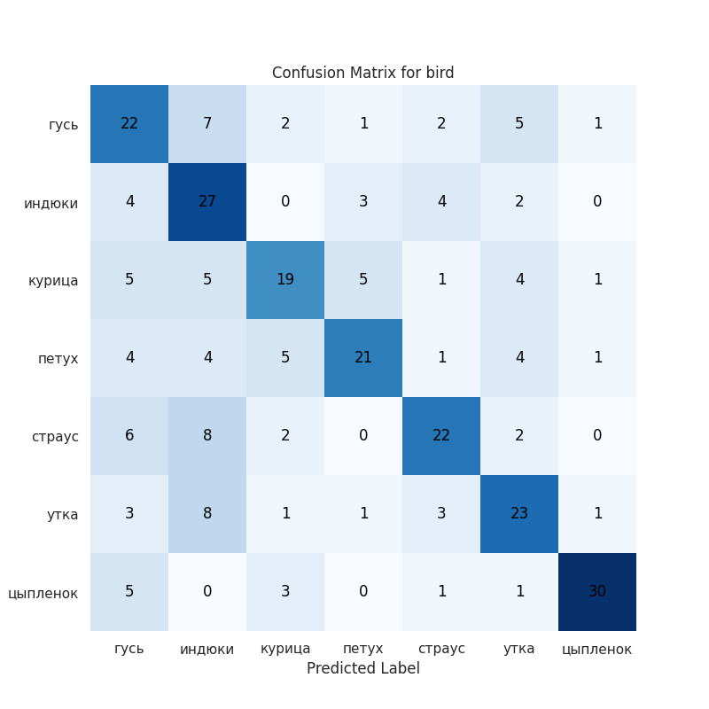
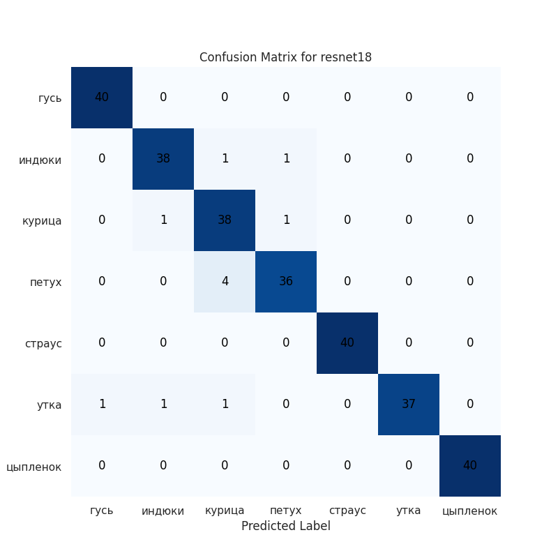
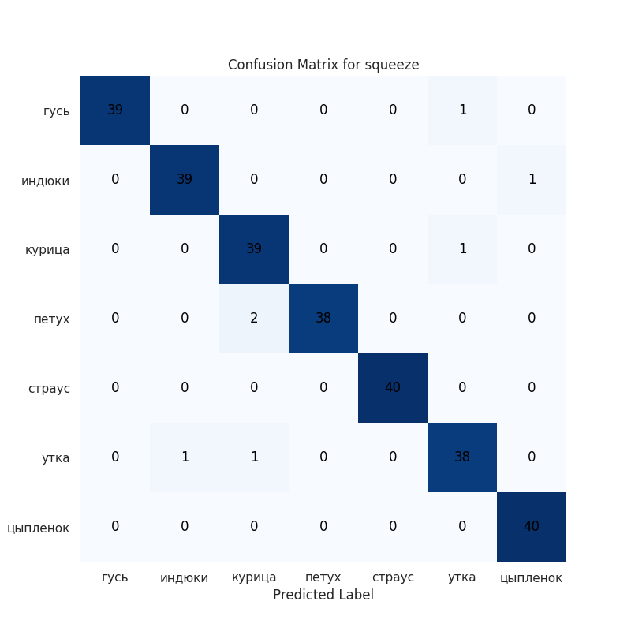
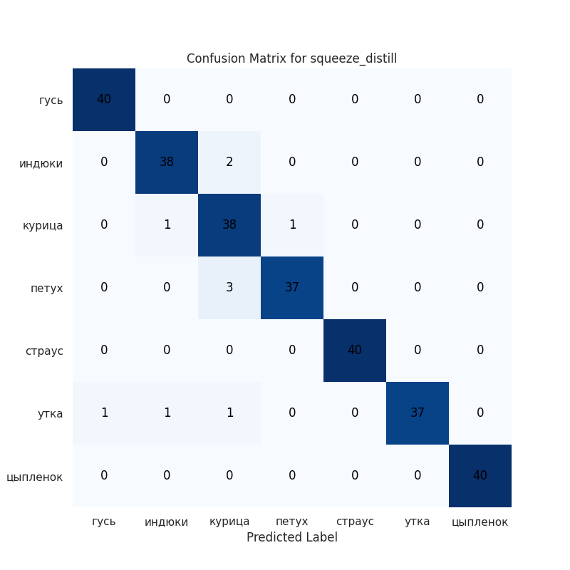

# Bird Classifier


## Описание
Приложение, распознающее изображения домашних птиц (курица, петух, страус, утка, цыпленок, гусь, индюк). Почти все обученные модели достигают точности более 85% на тестовом наборе

## Файлы проекта
- `weights/`: веса моделей
- `training.ipynb`: Jupyter-ноутбук с обучением модели
- `bot.py`: код Telegram-бота для распознавания
- `requirements.txt`: зависимости проекта
- `images/`: результаты обучения
- `model_results.csv`: результаты обучения в .csv

## Запуск Telegram-бота
1. Установка зависимостей:
    ```bash
    pip install -r requirements.txt
    ```
2. Добавление токена Telegram API в переменные окружения:
    ```bash
    export TELEGRAM_BOT_TOKEN='<токен>'
    ```
3. Запуск бота:
    ```bash
    python bot.py
    ```

## Результаты обучения 

| Model           |   Accuracy |    F1 |   Parameters |
|:----------------|-----------:|------:|-------------:|
| bird            |      0.586 | 0.59  |       433479 |
| resnet18        |      0.961 | 0.961 |     11180103 |
| resnet18_quant  |      0.961 | 0.961 |     11176512 |
| squeeze         |      0.975 | 0.975 |       726087 |
| squeeze_distill |      0.964 | 0.965 |       726087 |

*Bird Model* показывает очень слабые результаты, путает классы 
Обе версии *Resnet18* и *SqueezeNet* показывают прекрасные метрики

Также замечено, что метрики на тестовой выборке у моделей выше, чем в процессе обучения

На это могли повлиять следующие факторы: 

    1. Небольшой тестовый набор (280 изображений)
    
    2. Более простые изображения в тестовом наборе
    
    3. Частичное совпадение трейн и тест выборки










## Воспроизведение обучения

Рекомендуется воспроизводить обучение в google collab (предварительно загрузив датасет на свой гугл диск), т.к. это быстрей, и основная работа шла там.

[Открыть в Google Colab](https://colab.research.google.com/drive/1paSYm2p5zJFA7SQT0Y192bq_zaB5rgBV?usp=sharing)

Для воспроизведения обучения локально необходимо запустить jupyter notebook, установить зависимости, поместить в рабочую директорию squeezenet_distill.pth, requirements.txt

1. Создание окружения:
    ```bash
    python3 -m venv venv_for_test
    ```
2. Установка jupyter notebook и зависимостей:
    ```bash
    source venv_for_test/bin/activate
    pip install jupyter ipykernel
    pip install -r requirements.txt
    ```
3. Запуск ноутбука:
    ```bash
    jupyter notebook
    ```
